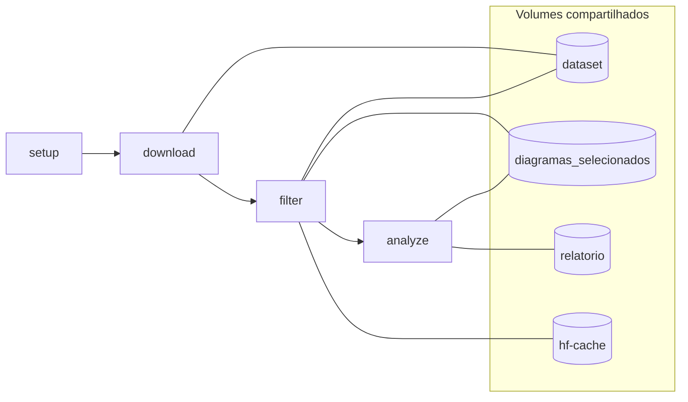

# STRIDE Analyzer

Projeto Python derivado do notebook Colab **prototipo_carga_de_diagramas_do_dataset_do_Kaggle_e_análise_STRIDE_v6**. Baixa diagramas de arquitetura do Kaggle, filtra por qualidade e executa análise de segurança **STRIDE** com exportação em JSON, PDF e DOCX.

Documentação completa (arquitetura + roteiro): [`docs/Documentação.pdf`](docs/Documentação.pdf)

Infográfico dos contêineres Docker: [`docs/infrografico_arquitetura_docker.png`](docs/infrografico_arquitetura_docker.png) · [`docs/infrografico_arquitetura_docker.pdf`](docs/infrografico_arquitetura_docker.pdf)

Infográfico dos módulos Python: [`docs/infrografico_python.png`](docs/infrografico_python.png) · [`docs/infrografico_python.pdf`](docs/infrografico_python.pdf)

Infográfico de integrações (Kaggle / OpenAI / Docker): [`docs/infrografico_diagrama_integração.png`](docs/infrografico_diagrama_integração.png) · [`docs/infrografico_diagrama_integração.pdf`](docs/infrografico_diagrama_integração.pdf)

## Estrutura do projeto

```
brunojose1977-fiap-tech-challenger-fase5/
├── dataset/                  # Dataset Kaggle (download local)
├── diagramas_selecionados/   # Diagramas aprovados pela filtragem
├── relatorio/                # JSON, PDF e DOCX gerados
├── docker/                   # Entrypoint do contêiner
├── docs/                     # Documentação e evidências
│   ├── Documentação.pdf      # Arquitetura e roteiro completo
│   ├── infrografico_arquitetura_docker.*  # Diagrama dos contêineres
│   ├── infrografico_python.* # Diagrama dos módulos Python
│   └── infrografico_diagrama_integração.* # Integrações externas
├── src/stride_analyzer/      # Código-fonte modular
├── tests/                    # Testes automatizados (pytest)
├── Dockerfile                # Imagem da aplicação
├── docker-compose.yml        # Orquestração modular do pipeline
├── pyproject.toml
├── .env.example
└── README.md
```

## Arquitetura (resumo)

CLI stateless (`stride-analyzer`) com pipeline em quatro etapas:

```
setup → download (Kaggle) → filter (OpenCV + CLIP) → analyze (GPT-4o Vision) → relatórios
```

| Módulo | Responsabilidade |
|--------|------------------|
| `cli.py` | Comandos e logging |
| `config.py` | Settings via variáveis de ambiente |
| `dataset.py` | Download/extração do dataset Kaggle |
| `image_analysis.py` | Nitidez, alinhamento e CLIP |
| `filter.py` | Seleção e cópia dos diagramas |
| `stride.py` | Análise STRIDE via OpenAI Vision |
| `reports.py` | Exportação JSON / PDF / DOCX |

Diagrama visual dos módulos: [`docs/infrografico_python.png`](docs/infrografico_python.png)

## Princípios Twelve-Factor aplicados

| Fator | Implementação |
|-------|---------------|
| **I. Codebase** | Repositório único, código em `src/stride_analyzer/` |
| **II. Dependencies** | `pyproject.toml` com dependências explícitas |
| **III. Config** | Variáveis de ambiente via `.env` (nunca commitadas) |
| **IV. Backing services** | Kaggle e OpenAI como recursos anexáveis |
| **V. Build, release, run** | Build da imagem Docker separado da execução |
| **VI. Processes** | CLI stateless (`stride-analyzer`) |
| **VII–VIII. Concurrency** | Processos/contêineres independentes por comando |
| **IX. Disposability** | Comandos iniciam e encerram rapidamente |
| **X. Dev/prod parity** | Mesma CLI e config em local e Docker |
| **XI. Logs** | Saída estruturada em stdout |
| **XII. Admin processes** | Comandos `setup`, `download`, `filter`, `analyze` |

---

## Arquitetura Docker

O pipeline foi containerizado com **Docker Compose**, separando cada etapa em um contêiner independente que compartilha volumes de dados.

Diagrama visual: [`docs/infrografico_arquitetura_docker.png`](docs/infrografico_arquitetura_docker.png)



| Serviço | Contêiner | Responsabilidade |
|---------|-----------|------------------|
| `setup` | stride-setup | Cria pastas e valida volumes |
| `download` | stride-download | Baixa dataset do Kaggle |
| `filter` | stride-filter | Filtra diagramas (OpenCV + CLIP) |
| `analyze` | stride-analyze | Análise STRIDE + relatórios |
| `pipeline` | stride-pipeline | Pipeline completo em um contêiner |

### Pré-requisitos Docker

- [Docker Desktop](https://www.docker.com/products/docker-desktop/) 4.x+
- Arquivo `.env` configurado (copie de `.env.example`)

### Build da imagem

```powershell
docker compose build
```

### Pipeline modular (recomendado)

Cada etapa em um contêiner, encadeada por `depends_on`:

```powershell
docker compose --profile modular up --abort-on-container-exit
```

### Pipeline monolítico (um contêiner)

Equivalente a `stride-analyzer run-all`:

```powershell
docker compose --profile monolith run --rm pipeline
```

### Executar etapa isolada

```powershell
docker compose --profile modular run --rm download
docker compose --profile modular run --rm filter
docker compose --profile modular run --rm analyze
```

### Volumes

| Volume / bind mount | Conteúdo |
|---------------------|----------|
| `./dataset` | Imagens do Kaggle |
| `./diagramas_selecionados` | Diagramas filtrados |
| `./relatorio` | JSON, PDF e DOCX |
| `hf-cache` (nomeado) | Cache do modelo CLIP (Hugging Face) |

---

## Roteiro: passo a passo para testar e executar

### Pré-requisitos

- Python 3.10 ou superior
- Conta [Kaggle](https://www.kaggle.com/) com API token
- Chave da API [OpenAI](https://platform.openai.com/)

### 1. Clonar ou acessar o projeto

```powershell
cd caminho\para\brunojose1977-fiap-tech-challenger-fase5
```

### 2. Criar ambiente virtual

```powershell
python -m venv .venv
.\.venv\Scripts\Activate.ps1
```

### 3. Instalar dependências

```powershell
pip install --upgrade pip
pip install -e ".[dev]"
```

### 4. Configurar variáveis de ambiente

```powershell
copy .env.example .env
```

Edite o arquivo `.env` e preencha:

```env
KAGGLE_USERNAME=seu_usuario
KAGGLE_KEY=sua_chave_api
OPENAI_API_KEY=sk-sua_chave
```

> Obtenha as credenciais Kaggle em: **Account → API → Create New Token** (gera `kaggle.json` com `username` e `key`).

### 5. Verificar pastas locais

```powershell
stride-analyzer setup
```

Saída esperada: status das pastas `dataset/`, `diagramas_selecionados/` e `relatorio/`.

### 6. Baixar o dataset (somente se não existir localmente)

```powershell
stride-analyzer download
```

- Se já houver imagens em `dataset/`, o download é **ignorado**.
- Caso contrário, baixa `carlosrian/software-architecture-dataset` do Kaggle para `dataset/` e remove arquivos `.xml`.

### 7. Filtrar e selecionar diagramas

```powershell
stride-analyzer filter
```

Aplica critérios de nitidez, alinhamento e classificação CLIP. Salva até 10 diagramas (configurável via `MAX_IMAGENS`) em `diagramas_selecionados/`.

Para pular o modelo CLIP (mais rápido, menos preciso):

```powershell
stride-analyzer filter --skip-clip
```

### 8. Executar análise STRIDE

```powershell
stride-analyzer analyze
```

- Lê todos os `.png` de `diagramas_selecionados/`
- Envia cada diagrama para GPT-4o (Vision)
- Gera em `relatorio/`:
  - `analise_stride_YYYYMMDD_HHMMSS.json`
  - `relatorio_stride_YYYYMMDD_HHMMSS.pdf`
  - `relatorio_stride_YYYYMMDD_HHMMSS.docx`

> Alternativa sem download: copie PNGs (por exemplo de `minha-seleção-diagramas/`) para `diagramas_selecionados/` e execute apenas `analyze`.

### 9. Executar pipeline completo (atalho)

```powershell
stride-analyzer run-all
```

Equivalente a: `download` → `filter` → `analyze`.

### 10. Rodar testes automatizados

```powershell
pytest
```

Com cobertura:

```powershell
pytest --cov=stride_analyzer --cov-report=term-missing
```

### 11. Executar lint

```powershell
ruff check src tests
```

---

## Comandos disponíveis

| Comando | Descrição |
|---------|-----------|
| `stride-analyzer setup` | Cria pastas e exibe status |
| `stride-analyzer download` | Baixa dataset do Kaggle se necessário |
| `stride-analyzer filter` | Filtra imagens e salva em `diagramas_selecionados/` |
| `stride-analyzer analyze` | Análise STRIDE + relatórios |
| `stride-analyzer run-all` | Pipeline completo |
| `stride-analyzer -v <cmd>` | Log detalhado |

## Variáveis de ambiente opcionais

| Variável | Padrão | Descrição |
|----------|--------|-----------|
| `PROJECT_ROOT` | raiz do projeto | Caminho base |
| `MAX_IMAGENS` | `10` | Máximo de diagramas selecionados |
| `SHARPNESS_THRESHOLD` | `150.0` | Limiar de nitidez (Laplaciano) |
| `KAGGLE_DATASET` | `carlosrian/software-architecture-dataset` | Dataset Kaggle |
| `OPENAI_MODEL` | `gpt-4o` | Modelo OpenAI |

## Solução de problemas

| Problema | Solução |
|----------|---------|
| `Credenciais Kaggle ausentes` | Preencha `KAGGLE_USERNAME` e `KAGGLE_KEY` no `.env` |
| `Chave OpenAI ausente` | Preencha `OPENAI_API_KEY` no `.env` |
| `Nenhum .png encontrado` | Execute `filter` ou copie `.png` manualmente para `diagramas_selecionados/` |
| Download lento | Normal na primeira execução; execuções seguintes usam cache local |
| Erro ao carregar CLIP | Verifique conexão e memória RAM; use `--skip-clip` temporariamente |

## Licença

MIT — TechChallenger Fase 5
